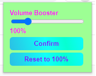
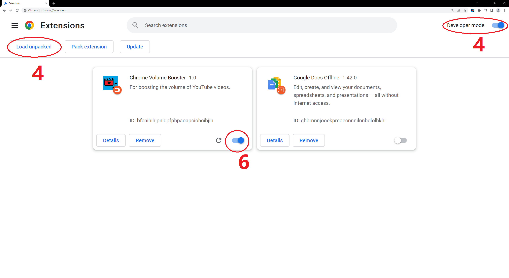

# Volume Booster for Chrome

A Google Chrome Extension for boosting HTML5 video elements.

UI| Features
--- | ---
 |   <ul><li>Volume selection from 0 to 500%</li><li>Confirm Button for Safety</li><li>Volume resets to 100% upon loading a new page</li></ul>

## Description

Volume Booster for Chrome scans for video elements on the current active tab and tweaks the volume of the
video elements via AudioContext. Users can adjust the volume of the video elements of each tab independently.

The inspiration of this project is that I often stumble across YouTube videos that have very low volume which makes it very hard to follow along.
Although there are a lot of similar Chrome Extensions on Chrome Web Store, some of the popular ones are either not open sourced, or requires many more permissions 
than actually required. Moreover, I also wanted to practice my Javascript, HTML and CSS skills, so I made this project as a useful tool and a coding practice for myself.

Challenges faced in this project includes managing permissions required, going through the documentations to find relevant libraries and methods, as well as making a clean and easy-to-use interface for Chrome users.

This project is built with Javascript, HTML and CSS only. 

## Getting Started

### Dependencies

* An up-to-date Google Chrome Browser

### Installing

1. Download the ZIP folder containing all the necessary files on [GitHub](https://github.com/Tyler-CY/Chrome-Volume-Booster), either by clicking the green "Code" button on the top right or through "Packages" tab on the right.
2. Unzip the ZIP folder in your preferred location. By default, the ZIP folder is in your Downloads directory.
3. Go to [Chrome Extensions](chrome://extensions/) (If the hyperlink doesn't work, the link is chrome://extensions/).
4. Turn on "Developer Mode" on the top right corner and select "Load unpacked" on the top left corner.
5. Select the directory Chrome-Volume-Booster-master (or Chrome-Volume-Booster-master-VERSION_NUMBER).
6. Enable "Chrome Volume Booster" and restart Google Chrome.

   

### Executing program

1. Begin using this extension by pinning the extension on the top right corner.
2. Open a website with HTML5 video element, e.g. any [YouTube](https://www.youtube.com) video and click on the Chrome Extension.

## Help

If the video on the website doesn't appear to have its volume adjusted, refresh the tab and start the extension again. All other tabs should be working.
### Known issues
- All the issues mentioned below is due to the fact that AudioContext cannot be launched without the user starting popup.html (as far as I know). However, some websites do not have this problem.
- YouTube: when YouTube is open for the first time, the extension requires a page refresh to work.
- Streamable: extension currently does not work on streamable. Users must temporarily disable the extension before using Streamable. I am currently working on this issue actively. Sorry for any inconvenience.

## Authors

[Tyler-CY](https://github.com/Tyler-CY)

## Version History

* 1.0
    * Initial Release
* 1.1
    * Added safety features to prevent physical equipment damage

## 

## License

This project is licensed under the Tyler-CY License - see the LICENSE.md file for details

## Acknowledgments

* [robertontiu's chrome-extension-volumest](https://github.com/robertontiu/chrome-extension-volumest)
* [Official Chrome Extension Developer Documentation](https://developer.chrome.com/docs/extensions/mv3/)
